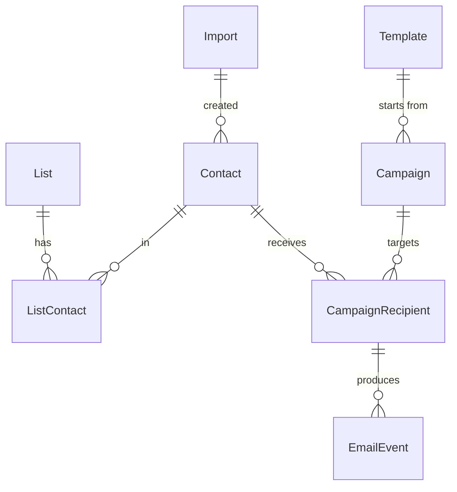
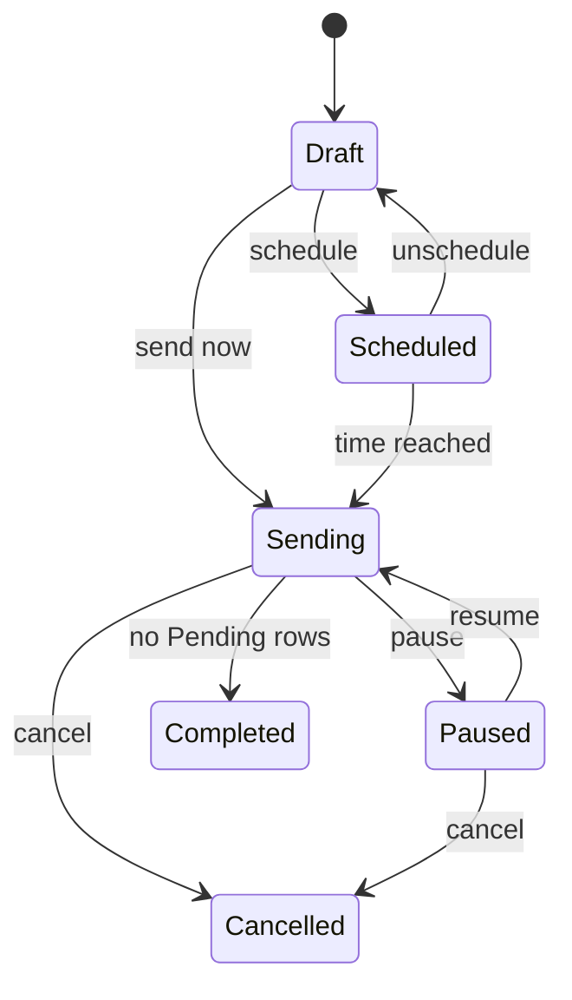

# Email Campaign Tool — Build Spec for Claude Code

As of Sep 23, 2026

## Purpose and constraints

A single-user tool to import contacts, build campaigns, send them through Azure Communication Services (ACS) Email, and see results. Ceiling: 20,000 emails a month with occasional bursts to about 50,000; typical use is about 10,000 contacts and one or two sends a month.

Hard constraints:

- One deployable ASP.NET Core app, one Azure SQL database, one Storage account. No queue service, Redis, Functions, containers, or microservices.
- A campaign can never reach the same contact twice; a database constraint enforces it.
- Unsubscribe and suppression are mandatory on every send; consented contacts only; nothing that evades provider limits.
- The UI stays responsive while a campaign sends; the web request path never calls ACS except for test emails.
- Email-only contacts are first-class: every field except email is optional, and a file that is just addresses imports without a mapping step.
- One person builds and maintains it; prefer boring, well-documented choices.

## Human inputs and long-pole tasks (start today)

The code is one to two days of continuous Claude Code work; these items gate the first real send, so start them before the build.

| Task | Who | Why it can't wait |
| --- | --- | --- |
| Pick the sending subdomain (e.g. `news.<yourdomain>`) and confirm you can add DNS records | You | Records go in during Phase 2; propagation takes minutes to hours |
| File the ACS Email quota request: Azure portal → Help + support → Service and subscription limits (quotas) → "Azure Communication Services Email: Sending Limits" | You | Free, but up to 72 hours to evaluate; click tracking cannot be switched on until the limit is raised |
| Create the Azure resources (resource group, App Service plan B1, Web App, SQL Basic, Storage, ACS + Email Communication Service), or log in once with `az login` and let Claude Code create them from the Bicep file | You or Claude Code | Everything deploys against them |
| Put secrets in App Service settings, never in the repo: SQL connection string, Storage connection string, ACS connection string, `Webhooks:AcsSecret`, `Auth:UnsubscribeKey`, `Auth:AllowedUsers` | You | Needed to deploy and to run the smoke tests |
| Seed inboxes you control on Outlook, Gmail, Yahoo, and iCloud | You | Inbox-placement check before the list sees anything |
| The subscriber CSV (email required, everything else optional) | You | Phase 3 import test |

Quota request wording: consented newsletter subscribers, about 10,000 contacts, one or two campaigns a month, list collected through your own sign-ups; ask for 30 per minute, 2,000 per hour, 10,000 per day.

## Decisions already made (Claude Code does not ask)

Every row here is final; the fallback column is the only permitted deviation.

| Area | Decision | Fallback |
| --- | --- | --- |
| Framework | .NET current LTS, Blazor Web App, Interactive Server render mode, MudBlazor UI | none |
| Data | EF Core code-first, Azure SQL Basic; `Database.Migrate()` at startup (single instance) | none |
| Background work | One `CampaignWorker : BackgroundService` and one nightly `RetentionWorker`, both inside the web process; App Service Always On | none |
| Sending | `Azure.Communication.Email` SDK behind an `IEmailSender` interface; one message per recipient; `SendAsync(WaitUntil.Started)` | Postmark implementation of `IEmailSender` if ACS quota is refused |
| Events | Event Grid system topic on the ACS resource → `POST /webhooks/acs?key=<secret>`; handle the subscription validation handshake | none |
| Auth | App Service Authentication with Entra ID; the app checks the signed-in UPN against `Auth:AllowedUsers`; `/unsubscribe/*`, `/webhooks/*`, `/health` allow anonymous | none |
| Editor | Unlayer embedded editor via JS interop; store design JSON and exported HTML | GrapesJS newsletter preset if Unlayer's free tier is unavailable |
| Merge fields | Scriban; `{{ first_name \| default: "there" }}` style fallbacks; every value HTML-encoded; unknown fields render empty | none |
| Rate limits | `Sending:MaxPerMinute` 25 and `Sending:MaxPerHour` 90 by default (under the ACS defaults of 30/100); raise in settings after the quota lands | none |
| Retries | Transient (429, 5xx, timeouts): 1 min, 5 min, 30 min, 2 h, 6 h, then Failed. Permanent (400 on the address): Failed at once, contact marked Invalid | none |
| Crash recovery | Rows in `Claimed` for over 10 minutes become `Unknown`; the UI shows them with a Retry button; never auto-resent | none |
| Time | Store UTC; display in `App:TimeZone` | none |
| Retention | Raw `EmailEvents` older than 12 months pruned nightly; campaign counters are permanent | none |
| Test emails | Never counted in statistics; at most 5 addresses per test | none |
| Styling | MudBlazor defaults, light theme, no extra CSS frameworks | none |
| Not built | Multi-tenancy, API keys, automations, segments, A/B tests, custom editor, queues, caches | none |

## Architecture and stack

One web app does everything; ACS and Event Grid are the only moving parts outside it.

```mermaid
flowchart LR
  B[Browser] -->|Entra sign-in| W[Blazor app<br/>App Service B1]
  W --> DB[(Azure SQL Basic)]
  W --> BS[(Blob Storage)]
  CW[CampaignWorker<br/>in-process] --> DB
  CW -->|one message per recipient| ACS[ACS Email]
  ACS --> EG[Event Grid]
  EG -->|delivery + click events| WH[/webhooks/acs]
  WH --> DB
```

The browser talks only to the Blazor app. The worker reads Pending rows from SQL and calls ACS at a fixed rate; ACS reports back through Event Grid into the same app, which updates the same rows. If the app is down, Event Grid keeps retrying for 24 hours, so no queue sits in front of the webhook.

Why this and not Functions plus a queue: at 20,000 emails a month the database is the queue, and one process removes distributed locking, a second deployable, and about $15 a month. The `IEmailSender` interface is the one seam kept deliberately, so a provider swap is a single class.

## Repository layout and conventions

One solution, one web project, one test project, one Bicep file.

```text
/src/CampaignTool.Web            Blazor app: UI, webhook + unsubscribe endpoints, workers
  /Components/Pages              Dashboard, Contacts, Lists, Import, Templates, Campaigns, Suppressions, Settings
  /Components/Shared             Layout, nav, progress bar, confirm dialog
  /Data                          AppDbContext, entities, migrations
  /Services                      ContactImportService, RecipientMaterializer, CampaignService,
                                 IEmailSender + AcsEmailSender, RateLimiter, TemplateRenderer,
                                 EventProcessor, UnsubscribeTokenService, CsvExporter
  /Workers                       CampaignWorker, RetentionWorker
  /Endpoints                     AcsWebhookEndpoint, UnsubscribeEndpoint, HealthEndpoint
  /wwwroot/js/editor.js          Unlayer interop (init, load design, export HTML)
/tests/CampaignTool.Tests        xUnit; in-memory IEmailSender; SQL LocalDB or a local SQL container
/infra/main.bicep                Plan B1, Web App, SQL server + Basic db, Storage, ACS, Email service, Event Grid subscription
/.github/workflows/deploy.yml    build → test → publish → deploy
SPEC.md                          this document
PROGRESS.md / BLOCKERS.md        written by Claude Code as it works
```

Conventions:

- Nullable reference types on; `TreatWarningsAsErrors` off.
- All configuration through `IOptions<T>` bound to the keys in the Configuration section; locally via `dotnet user-secrets`, in Azure via App Service settings.
- Entities are plain classes; no repository layer over EF Core; services take `AppDbContext` directly.
- Every service method that changes campaign or contact state logs one structured line (`ILogger`, App Insights sink).
- No JavaScript beyond the editor interop; Blazor handles the rest.
- Migrations are named by phase (`Phase1_Initial`, `Phase3_Imports`, and so on).

## Data model

Nine tables; `CampaignRecipients` and `EmailEvents` carry the volume, and a 2 GB Basic database holds years of it at 20,000 emails a month.



| Table | Columns | Constraints and indexes |
| --- | --- | --- |
| Contacts | Id, Email, EmailNormalized, FirstName?, LastName?, CustomFields (JSON), Status (Subscribed, Unsubscribed, Bounced, Complained, Invalid), StatusReason?, StatusChangedAtUtc, SoftBounceCount, Source, ImportId?, CreatedAtUtc, UpdatedAtUtc | Unique(EmailNormalized); index(Status) |
| Lists | Id, Name, Description?, CreatedAtUtc | Unique(Name) |
| ListContacts | ListId, ContactId, AddedAtUtc | PK(ListId, ContactId) |
| Suppressions | EmailNormalized, Reason (Unsubscribe, HardBounce, Complaint, Manual), Source, CreatedAtUtc | PK(EmailNormalized) |
| Templates | Id, Name, DesignJson, Html, CreatedAtUtc, UpdatedAtUtc | Unique(Name) |
| Campaigns | Id, Name, Subject, Preheader?, FromName, FromEmail, ReplyTo?, ListId, ExcludeListIds (JSON), TemplateId?, DesignJson, Html, Status, ScheduledAtUtc?, StartedAtUtc?, CompletedAtUtc?, Recipients, Sent, Delivered, Bounced, Failed, Clicked, Unsubscribed, CreatedAtUtc | index(Status, ScheduledAtUtc) |
| CampaignRecipients | Id, CampaignId, ContactId, EmailSnapshot, Status (Pending, Claimed, Sent, Delivered, Bounced, Failed, Cancelled, Unknown), AttemptCount, NextAttemptAtUtc?, ClaimedAtUtc?, AcsMessageId?, LastError?, SentAtUtc?, DeliveredAtUtc?, ClickCount | Unique(CampaignId, ContactId); index(CampaignId, Status, NextAttemptAtUtc); index(AcsMessageId) |
| EmailEvents | Id, EventId, CampaignRecipientId?, AcsMessageId, Kind (Delivery, Engagement), Status, Url?, UserAgent?, OccurredAtUtc, RawJson | Unique(EventId); index(CampaignRecipientId); index(OccurredAtUtc) for retention |
| Imports | Id, FileName, BlobPath, Status, TotalRows, Imported, Updated, Skipped, Invalid, ErrorsJson, ListId?, CreatedAtUtc, CompletedAtUtc? |  |
| Settings | Key, Value | PK(Key) |

Notes:

- `EmailSnapshot` on the recipient row is what was actually sent to, so a later edit of the contact never rewrites history.
- Counters on `Campaigns` are maintained by the worker and the event processor; the results page reads them, never a `COUNT(*)` over recipients.
- No Users table: identity comes from Entra; no Organizations, APIKeys, or Automations tables.

## Contact import, including email-only files

Email is the only required column; a file that is just a list of addresses imports with no mapping step.

Flow: Upload → Detect → Map (skipped when the file has one column) → Validate → Preview counts → Confirm → Import in the worker → Summary.

Rules:

- Accept `.csv` and `.txt` up to 50 MB; UTF-8 with or without BOM; comma, semicolon, or tab delimiter auto-detected; header row auto-detected (first row has no `@` and the second does → header).
- A one-column file, or any column whose values are over 90% email-shaped, is mapped to Email automatically. Multi-column files show a mapping table: CSV column → Email, First name, Last name, a named custom field, or Ignore.
- Normalize each address: trim, lowercase, strip surrounding quotes, and pull the address out of `Name <addr@example.com>`.
- Validate syntax only: one `@`, a dot in the domain, no spaces or consecutive dots. No MX or SMTP probing.
- Duplicates inside the file: keep the first, count the rest as Skipped. Existing contact: update non-empty fields only (`Import:UpdateExisting`, default true).
- An import never changes Status. An address that is Unsubscribed, Bounced, Invalid, or in Suppressions stays that way; it is imported for history and shown as excluded in list counts.
- Optional "add everyone to list" on the Confirm step, with a list picker or a new-list name.
- Parsing and writes run in the worker in batches of 1,000 with `SaveChanges` per batch; the wizard polls the `Imports` row every 2 seconds for progress. A 10,000-row file finishes in under 2 minutes.
- Summary shows Imported, Updated, Skipped, Invalid, plus a rejects CSV with one reason per row.
- Exports prefix any cell starting with `=`, `+`, `-`, or `@` with an apostrophe (CSV injection).
- The uploaded file is kept in the private `imports` container for 30 days, then deleted by the retention job.

## Campaign sending pipeline

The database is the queue: one row per recipient, claimed atomically, sent at a fixed rate, and finished by events.



1. Materialize. On Send or Schedule, insert one `CampaignRecipient` per contact in the target list minus excluded lists, skipping any contact whose Status is not Subscribed or whose address is in Suppressions. `Recipients` = rows inserted. The unique index makes a second insert for the same contact fail, not duplicate.
2. Scheduler tick every 15 seconds: `Scheduled` campaigns with `ScheduledAtUtc <= now` become `Sending`.
3. Claim a batch atomically: `UPDATE TOP (@n) CampaignRecipients SET Status='Claimed', ClaimedAtUtc=@now OUTPUT inserted.* WHERE CampaignId=@id AND Status='Pending' AND (NextAttemptAtUtc IS NULL OR NextAttemptAtUtc<=@now)`, where n = min(`Sending:BatchSize`, tokens available).
4. Rate limit with a token bucket per minute and per hour from settings; the worker sleeps until a token is free. One campaign sends at a time, oldest `StartedAtUtc` first.
5. Render subject and HTML through Scriban with the contact's fields; append the footer (mailing address, unsubscribe link); set `List-Unsubscribe` and `List-Unsubscribe-Post: List-Unsubscribe=One-Click` headers.
6. Send with `EmailClient.SendAsync(WaitUntil.Started)`; store the operation id as `AcsMessageId`, set Status `Sent` and `SentAtUtc`, increment `Sent`.
7. On a transient failure, set Status back to `Pending`, `AttemptCount + 1`, `NextAttemptAtUtc` from the backoff table; after five attempts, `Failed`. On a permanent failure, `Failed` and the contact becomes Invalid.
8. Check Pause and Cancel before every batch. Cancel sets every remaining `Pending` row to `Cancelled`.
9. When no `Pending` or `Claimed` rows remain, the campaign is `Completed`.
10. On startup and every tick, `Claimed` rows older than 10 minutes become `Unknown`; they are never resent automatically.
11. After each batch the worker raises a `CampaignProgress` event; the campaign monitor page subscribes and re-renders its counters, so progress is live without polling.
12. Test emails go straight from the campaign editor to up to five addresses, flagged `IsTest`, and never create recipient rows.

## Events, bounces, unsubscribe, suppression

Every ACS event is stored once and applied once; unsubscribes and hard bounces suppress the address itself, not just the contact record.

Webhook `POST /webhooks/acs?key=<secret>`:

- Reject any request whose key does not match `Webhooks:AcsSecret`. Answer the Event Grid `SubscriptionValidationEvent` with its validation code.
- Insert each event into `EmailEvents` with `EventId` unique; a duplicate is acknowledged with 200 and ignored.
- `Microsoft.Communication.EmailDeliveryReportReceived`: Delivered → recipient Delivered; Bounced → Bounced; Suppressed, FilteredSpam, Quarantined, Failed → Failed with `LastError` set to the status. Update campaign counters in the same transaction.
- `Microsoft.Communication.EmailEngagementTrackingReportReceived`: `view` is stored only (opens are unreliable); `click` stores the URL and increments `Clicked` once per recipient, `ClickCount` on every click.
- Match on `AcsMessageId`; an event for an unknown message is stored and logged, never dropped.
- Always return 200 within 5 seconds; do the work in a short transaction, not a background task.

Bounces:

- Hard bounce (bad address, domain not found) → contact Status Bounced and a Suppressions row with reason HardBounce.
- Soft bounce (mailbox full, temporary) → `SoftBounceCount + 1`; three in a row is treated as hard.
- ACS status Suppressed means ACS's own list blocked it → the contact is marked Bounced too.

Unsubscribe:

- Token = base64url of `contactId:campaignId` plus an HMAC-SHA256 over it with `Auth:UnsubscribeKey`; link `/unsubscribe/{token}` in every footer.
- GET shows a page with one button; POST (the button or the one-click header) sets Status Unsubscribed, adds a Suppressions row with reason Unsubscribe, increments the campaign's `Unsubscribed`, and shows a confirmation. A tampered or expired token shows a plain error.
- Never requires sign-in; still works if the campaign was deleted.

Suppression:

- `Suppressions` is checked at materialization and at import. The Suppressions page allows manual add with a reason and manual removal.
- Removing a suppression never re-subscribes a contact; that is a separate, deliberate action on the contact page.
- Spam complaints are not exposed as a separate ACS event; treat rising FilteredSpam counts as the signal and stop the campaign if they exceed 0.5% of Sent.

## Deliverability and DNS

Send from a dedicated subdomain so the operating domain's reputation is never at stake.

| Record | Host | Value | Purpose |
| --- | --- | --- | --- |
| TXT | `news` | Verification string shown in the ACS portal | Proves domain ownership |
| TXT | `news` | SPF value shown in the ACS portal | Authorizes ACS to send for the subdomain |
| CNAME ×2 | Two selector hosts shown in the ACS portal | DKIM targets shown in the ACS portal | Signs every message |
| TXT | `_dmarc.news` | `v=DMARC1; p=none; rua=mailto:dmarc@<yourdomain>` | Monitoring first; change to `p=quarantine` after three clean sends |
| MX | `news` | A mail host you control (the operating domain's is fine) | Microsoft recommends an MX even for outbound-only sending; a domain without one is more likely to be marked spam |

Built into the app:

- One From name and address per campaign, defaulted from Settings; Reply-To defaults to a monitored mailbox and cannot be empty.
- The mailing address and unsubscribe link are injected into every send; Send is refused if `App:MailingAddress` is empty.
- Settings has a "Check DNS" button that resolves the five records and shows pass or fail for each.
- Campaign images are served from the public Blob container over HTTPS with one-year cache headers; no link shorteners; tracked links are rewritten by ACS on the sending domain.

Warm-up for the first list (about one week):

| Day | Send to | Stop if |
| --- | --- | --- |
| 1 | Seed inboxes only | Any seed lands in spam or fails DKIM |
| 2 | 1,000 most recently added subscribers | Bounces over 2% or any FilteredSpam |
| 4 | Next 4,000 | Same thresholds |
| 7 | Full list | Same thresholds |

After the quota increase lands, raise `Sending:MaxPerHour` in Settings; do not exceed what Microsoft granted.

## Screens

Fourteen pages on one left navigation rail; every page loads in under a second because nothing on the request path touches ACS.

| Page | Route | What it shows or does |
| --- | --- | --- |
| Dashboard | `/` | Any campaign sending now with live progress; last five campaigns with counts; contacts by status |
| Contacts | `/contacts` | Searchable, paged grid; filters by status and list; bulk add-to-list, unsubscribe, delete; export CSV |
| Contact | `/contacts/{id}` | Fields, lists, status with reason and date, campaign history (sent, delivered, clicked, unsubscribed) |
| Import | `/contacts/import` | Wizard: Upload → Map → Preview → Import → Summary, with a progress bar while parsing |
| Lists | `/lists` | Create, rename, delete; member count and sendable count (after suppression) |
| Templates | `/templates` | Card grid with thumbnails; duplicate, delete |
| Template editor | `/templates/{id}` | Unlayer editor; save; desktop and mobile preview; send test |
| Campaigns | `/campaigns` | Grid: name, status, list, scheduled or sent date, recipients, delivered %, clicks; duplicate |
| Campaign editor | `/campaigns/{id}/edit` | Stepper: Setup (name, subject, preheader, from, reply-to) → Content (editor or pick a template) → Recipients (list, exclusions, live sendable count) → Test → Schedule or Send now |
| Campaign monitor | `/campaigns/{id}` | Live counters and progress bar; Pause, Resume, Cancel; Unknown rows with Retry; last 50 events |
| Campaign results | `/campaigns/{id}/results` | Sent, Delivered, Bounced, Failed, Clicked, Unsubscribed; per-link click table; recipient list filterable by status; export |
| Suppressions | `/suppressions` | Search; add with reason; remove |
| Settings | `/settings` | From name and email, reply-to, mailing address, time zone, sending limits, Check DNS |
| Unsubscribe | `/unsubscribe/{token}` | Public, no app layout, one button, confirmation |

UI rules: every destructive action confirms once; every long action shows a progress indicator rather than a spinner; errors show what happened and what to do next in one sentence.

## Configuration keys

All keys bind through `IOptions<T>`; secrets never appear in the repo.

| Key | Example or default | Notes |
| --- | --- | --- |
| `ConnectionStrings:Sql` | Azure SQL connection string | App Service setting |
| `ConnectionStrings:Storage` | Storage account connection string | App Service setting |
| `Acs:ConnectionString` | ACS resource connection string | App Service setting |
| `Acs:SenderAddress` | `updates@news.<yourdomain>` | Must be a configured MailFrom address on the ACS domain (`DoNotReply@<domain>` exists by default; extra addresses need the quota increase) |
| `Webhooks:AcsSecret` | 32+ random characters | Query-string key on the webhook |
| `Auth:AllowedUsers` | `you@<yourdomain>` | Comma-separated UPNs allowed in |
| `Auth:UnsubscribeKey` | 32+ random characters | HMAC key for unsubscribe tokens |
| `Sending:MaxPerMinute` | 25 | Raise after quota approval |
| `Sending:MaxPerHour` | 90 | Raise after quota approval |
| `Sending:BatchSize` | 25 | Rows claimed per loop |
| `App:TimeZone` | your IANA zone, e.g. `America/Chicago` | Display only; storage is UTC |
| `App:MailingAddress` | Postal address | Required in every footer |
| `App:BaseUrl` | `https://campaigns.<yourdomain>` | Used to build unsubscribe links |
| `Import:UpdateExisting` | true | Merge non-empty fields into existing contacts |
| `Retention:EventMonths` | 12 | Raw events pruned after this |
| `Storage:PublicContainer` | `email-assets` | Public read for images |
| `Storage:UploadsContainer` | `imports` | Private; files deleted after 30 days |

## Build phases and acceptance criteria

Work the phases in order; each ends with a commit, green tests, and a deploy. A phase is done only when every line under it is true.

1. **Foundation.** Solution, Blazor app, and MudBlazor shell run locally. EF Core initial migration creates every table in the data model. App Service Authentication with Entra signs you in and rejects any UPN not in `Auth:AllowedUsers`. `infra/main.bicep` deploys plan, Web App, SQL, Storage, ACS, and Email service. GitHub Actions builds, tests, and deploys on push to `main`. `/health` returns 200 in Azure.
2. **ACS and events.** `IEmailSender` with `AcsEmailSender` and an in-memory fake. Settings page saves and loads. Event Grid subscription targets the webhook and the validation handshake passes. A test send from Settings lands in a seed inbox and its Delivered event is in `EmailEvents` within 2 minutes.
3. **Contacts.** Contacts grid, contact page, lists, suppressions page. Import wizard end to end: a 10,000-row one-column file imports with no mapping step in under 2 minutes with correct Imported, Skipped, and Invalid counts; a multi-column file shows mapping; a re-import updates fields but never changes status.
4. **Templates and editor.** Unlayer loads inside Blazor, saves and reloads design and HTML. Merge-field preview renders for a contact with a name and for an email-only contact (fallback text appears). Test send from the editor works.
5. **Campaigns and sending.** Campaign stepper complete. Materialization excludes unsubscribed, bounced, invalid, and suppressed contacts and excluded lists; the sendable count matches. Send now and Schedule both work. The worker sends at the configured rate and never exceeds it. Pause, resume, and cancel work mid-send. Restarting the app mid-send produces no duplicate sends (only Unknown rows). The monitor page updates without refresh.
6. **Results and unsubscribe.** Webhook updates recipient statuses and campaign counters. Results page shows counts and per-link clicks. Unsubscribe page and the one-click header both work from a seed inbox; the unsubscribed contact is excluded from the next materialization. Recipient export downloads.
7. **Hardening.** Azure Monitor alerts exist for: recipient Failed above 2% of Recipients, webhook 5xx above 5 in 5 minutes, a campaign in Sending with no batch for 30 minutes, Unknown rows above 0. Nightly retention job runs. SQL point-in-time restore verified once. README has a runbook: rotate secrets, raise sending limits, add a sender address, restore the database.

Expected wall clock with Claude Code running continuously: Phases 1 to 7 in one to two days of work; the first send to the real list waits on DNS and the ACS quota, not on code.

## Tests and definition of done

Unit tests cover the rules that protect the list and the domain; the smoke tests prove the deployed app against real ACS.

Unit tests (xUnit) that must exist:

- Email normalization and validation: display names, uppercase, BOM, trailing spaces, missing `@`, double dots.
- CSV detection: one column without header, one column with header, semicolon, tab, quoted fields, Excel export with BOM.
- Import dedupe within a file and against existing contacts; status never changed by an import.
- Merge-field rendering with and without a name; every value HTML-encoded; unknown field renders empty.
- Unsubscribe token sign and verify; a tampered token is rejected.
- Rate limiter: never more than `MaxPerMinute` sends in any 60-second window, never more than `MaxPerHour` in any hour.
- Campaign state machine: every allowed transition passes, every other transition throws.
- Materialization excludes Unsubscribed, Bounced, Invalid, Suppressed, and excluded lists; a duplicate insert for the same contact fails on the unique index.
- Webhook: validation handshake answered; duplicate `EventId` ignored; each delivery status maps to the right recipient status; a click counts once per recipient.
- Retry schedule matches the backoff table and ends in Failed after five attempts.
- Crash recovery: a `Claimed` row older than 10 minutes becomes Unknown and is not resent.

Smoke tests against the deployed app, run before a phase is called done:

- Send a test email; the Delivered event is stored within 2 minutes.
- Import the real subscriber file; counts match what you expect from the file.
- Run a 50-recipient campaign to seed and internal addresses; all reach Delivered; pause and resume once mid-send; unsubscribe from one seed and confirm it is excluded next time.

MVP is done when all seven phases pass, the README runbook is complete, and one real campaign has gone to the day-2 warm-up slice with bounces under 2%.

## Deployment

Everything lives in `infra/main.bicep` and one GitHub Actions workflow; a push to `main` is a deploy, and the whole stack runs for about $25 a month.

| Resource | SKU and settings | Approx. monthly (USD) |
| --- | --- | --- |
| App Service plan + Web App (Linux) | B1, Always On, HTTPS only, custom host name with a free managed certificate | 13 |
| Azure SQL | Basic, 2 GB, firewall rule "Allow Azure services", point-in-time restore (7 days) | 5 |
| Storage account | Standard LRS; containers `email-assets` (public blob) and `imports` (private) | under 1 |
| ACS + Email Communication Service | Pay-as-you-go, custom domain; about $0.00025 per email plus data | 5 at 20,000 emails |
| Event Grid system topic + subscription | Webhook endpoint, default 24-hour retry | under 1 |
| Application Insights | Free ingestion tier at this volume | 0 |

Pipeline: restore → build → test → `dotnet publish` → deploy to the Web App with OIDC federated credentials → GET `/health`. Migrations apply at app start. Rollback is redeploying the previous successful workflow run.

Secrets: App Service settings only; locally `dotnet user-secrets`. Rotate `Webhooks:AcsSecret` by updating the setting and the Event Grid subscription URL together.

Alerts (Azure Monitor, email to you): webhook 5xx above 5 in 5 minutes; recipient Failed above 2% of a campaign; a campaign in Sending with no batch for 30 minutes; App Service CPU above 80% for 15 minutes; SQL storage above 80% of 2 GB.

No staging environment for a one-person tool: test locally with the in-memory sender and a local SQL, then deploy. If a change touches sending, run the 50-recipient smoke campaign before the next real send.

## Out of scope

Not in the MVP, and not to be scaffolded, stubbed, or left as TODOs "for later":

- Multiple users, roles, organizations, multi-tenancy
- Public API, API keys, outbound webhooks
- Automations, drip sequences, triggers
- Segments beyond list plus exclusions
- A/B testing, send-time optimization
- A custom drag-and-drop editor
- Open-rate KPIs on the dashboard (opens are stored, not featured)
- Dedicated IPs or IP warm-up tooling
- Queues, caches, Functions, containers, a separate frontend
- Analytics warehouse or Power BI

After the MVP has sent three real campaigns, the first candidates to add are saved segments, resend-to-non-clickers, and a second sender address.

## Kickoff prompt for Claude Code

Open Claude Code in this repo and paste the prompt below as the first message (it is also in `KICKOFF.md`).

```markdown
Read SPEC.md and CLAUDE.md fully before writing any code. Build the MVP exactly as specified, working through Phases 1 to 7 in order without stopping for approval.

Rules:
- Every row in "Decisions already made" is final. Do not ask about stack, structure, or scope.
- When you need something only I can provide (a secret, a DNS record, the ACS quota, a seed inbox, Azure resources), write the exact ask to BLOCKERS.md, use the in-memory IEmailSender and a local SQL database, and continue with the next task that is not blocked.
- If `az` is logged in, create the Azure resources from infra/main.bicep yourself; otherwise list the resource names and settings I must create in BLOCKERS.md.
- Commit at the end of each phase with tests green. Commit message: "Phase N: <what works now>".
- After each phase, update PROGRESS.md with what is done, what is verified in Azure, and what is waiting on me.
- Prefer the simplest implementation that meets the acceptance criteria. No extra abstractions and nothing from "Out of scope".
- If a library named in the spec is unavailable or broken, use the named fallback and note it in PROGRESS.md.
- Never put a secret in the repo, a log line, or a test fixture.

Start with Phase 1. Report back only when Phase 1's acceptance criteria are met or you are fully blocked.
```

While it works, clear BLOCKERS.md as fast as you can: the DNS records, the quota ticket, and the secrets are the only things standing between the code and the first real send.
